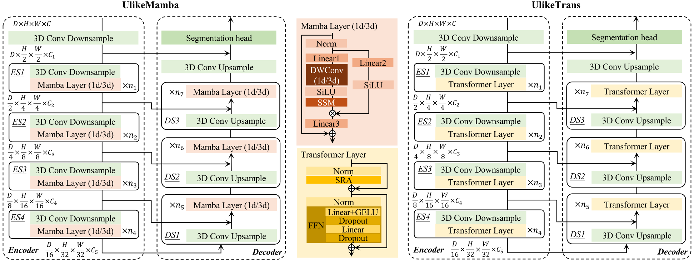
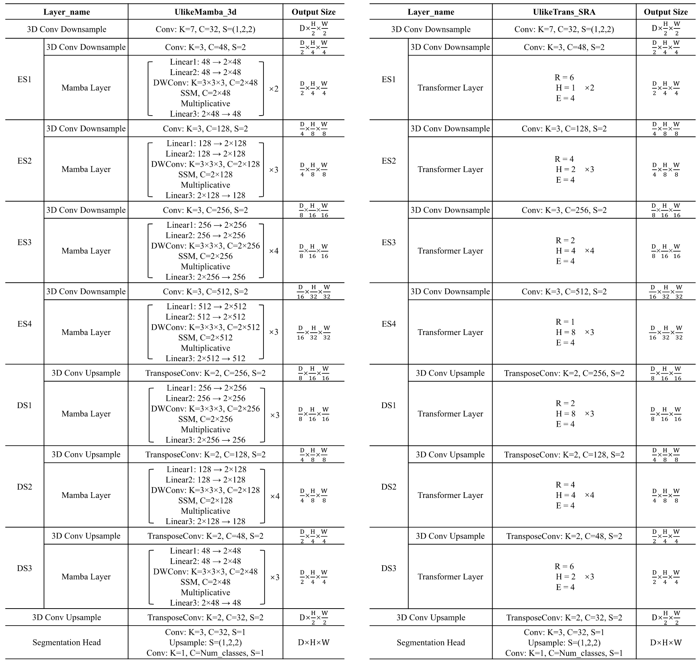
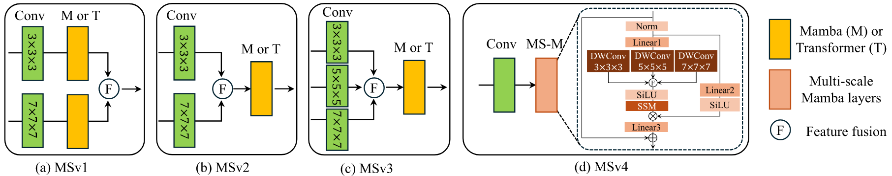
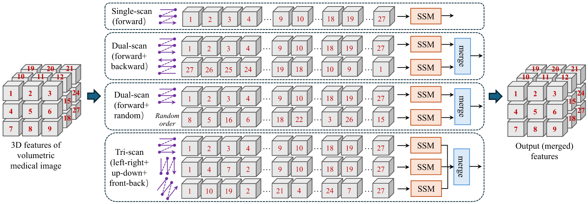
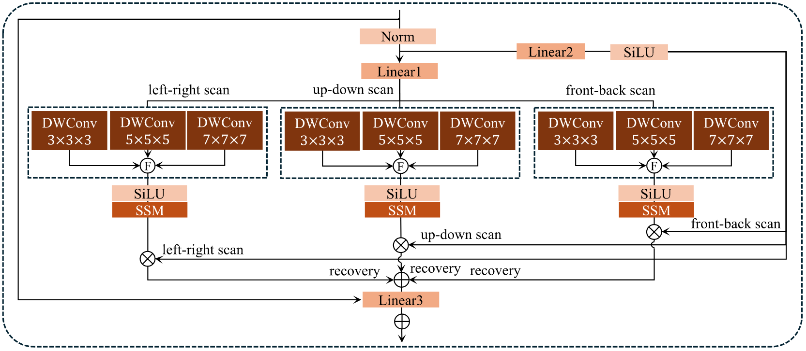

# Mamba3D-MedSeg

> Official repository for the paper  
> **"A Comprehensive Analysis of Mamba for 3D Volumetric Medical Image Segmentation"**  
> *Pattern Recognition, 2025*  
>  
>  
>   

---

## 🧠 Overview

This repository will host the official implementation and experiment instructions for our paper *A Comprehensive Analysis of Mamba for 3D Volumetric Medical Image Segmentation*.

Our study provides an extensive exploration of Mamba architectures for volumetric medical image segmentation, benchmarking them against established 3D CNN and Transformer-based methods.

---

## 🔍 Key Analysis

This section highlights several core findings and visual summaries from the paper.  

### Figure 1 – Comparison of Model Architectures Between UlikeMamba and UlikeTrans



*High-level illustration of the 3D Mamba-based segmentation pipeline and comparison baselines.*

---

### Figure 2 – Network Configurations



*Left: detailed configurations of UlikeMamba 3d network. Here, ‘K’: kernel size of Conv, DW-
Conv, or TransposeConv; ‘C’: number of channels; and ‘S’: stride. Right: Detailed configurations of Ulike-
Trans SRA network. Here, ‘R’: reduction ratio of SRA; ‘H’: head number of SRA; and ‘E’: expansion ratio
of FFN.*

---

### Figure 3 – Multiscale Feature Fusion Strategies



*Four multi-scale modeling schemes for evaluating and comparing the long-range dependency
modeling capabilities of Mamba and Transformers for multi-scale representation learning.*

---

### Figure 4 – Scanning Strategies



*UlikeMamba 3d with different sequential scanning strategies.*

---

### Figure 5 – UlikeMamba_3dMT Architecture



*Our proposed Mamba layer in UlikeMamba 3dMT, which modifies the original 1D depthwise
convolution to 3D depthwise convolution, embraces a multi-scale strategy and incorporates tri-directional
scanning to capture comprehensive spatial relationships in 3D volumetric data more effectively.*

---

## ⚙️ Installation

This section provides a template for setting up the environment used in our experiments.  
Fill in the exact commands according to your preferred package manager (conda, pip, etc.) and your hardware setup.

### 1. Clone the repository

```bash
# TODO: add the exact clone command
# Example:
# git clone https://github.com/uakhan17/Mamba3D-MedSeg.git
# cd Mamba3D-MedSeg
